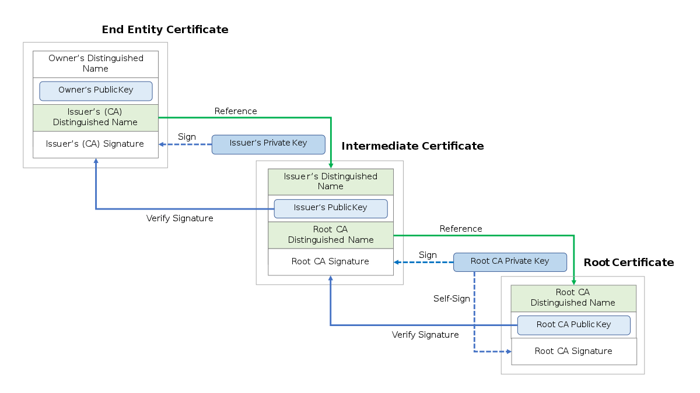

# Chain of Trust
* TOC
{:toc}

## Background
When you saw these errors in your web services, what is the next thing to do?

>  NET::ERR_CERT_COMMON_NAME_INVALID   
>  NET::ERR_CERT_DATE_INVALID   
>  NET::ERR_CERT_AUTHORITY_INVALID  
>  NET::ERR_CERT_REVOKED  

TLS certificate can go as deep as you want to give up, that's why we have [Let's encrypt](https://letsencrypt.org/) and all sorts of automatic tools to generate free (well-known) certificates for you.  
But no matter you are a backend/frontend developer, devops, using containization or cloud products, working with service mesh... understand the chain of trust would always help you to understand most of the common TLS issues.



In this session:
- We will start with creating our self-defined root certificate(certificate authority) and its private key; 
- Use this root CA (and its openssl_ca.cnf) to sign intermediate certificate;
- Use Intermediate certificate (openssl_intermediate.cnf) to sign server certificate;
- Create certificate bundle(for nginx web application).

### Create Your Own CA Certificate 
1. (Optional) with [encrypted CA privated key](https://www.golinuxcloud.com/generate-self-signed-certificate-openssl/#Create_encrypted_password_file_Optional)
```
mkdir cert  
echo mysecret > secret_file
openssl enc -aes256 -pbkdf2 -salt -in secret_file -out cert/secret_file.enc
```
Generate the CA certificate private key
>openssl genrsa -des3 -passout file:cert/secret_file.enc -out cert/ca.key 2048

Verify the private key content

>openssl rsa -noout -text -in cert/ca.key -passin file:cert/secret_file.enc

2. Or if without salt just skip the step 1 and generate the ca.key directly:
> openssl genrsa -out cert/ca.key 2048

3. Create CA certificate
openssl_ca.cnf is used to define rules and default values for root certificate, e.g.

```
[ req_distinguished_name ]  # default CN for root CA
countryName                     = Country Name (2 letter code)
stateOrProvinceName             = State or Province Name
...
countryName_default		= US 
stateOrProvinceName_default	= CA
localityName_default			= SAN
0.organizationName_default		= test
commonName_default			= lissff.ca.com
commonName_max_default			= 64
emailAddress_default			= mavis.tangtang@gmail.com
emailAddress_max_default		= 64

[ v3_intermediate_ca ]  # define key usage for intermediate CA
subjectKeyIdentifier = hash
authorityKeyIdentifier = keyid:always,issuer
basicConstraints = critical, CA:true, pathlen:0
keyUsage = critical, digitalSignature, cRLSign, keyCertSign
```

And pass the openssl_ca.cnf to -config:
> openssl req -config openssl_ca.cnf -new -x509  -extensions v3_ca -key cert/ca.key -out cert/ca.cert.pem -days 365 -passin file:cert/secret_file.enc

Or you could pass the CN as parameter (not recommended for chian of trust):
> openssl req -new -x509 -days 365 -key cert/ca.key -out cert/ca.cert.pem -passin file:cert/secret_file.enc -subj "/C=US/ST=CA/L=San/O=test/CN=lissff.ca.com/emailAddress=mavis.tangtang@gmail.com"

4. Verify the CA certificate

>openssl x509 -noout -text -in cert/ca.cert.pem  

### Generate Intermediate Certificate

1. In order to create intermediate certificate, we need below files to be configured(in cert folder)
```
echo 01 > serial
touch index.txt
touch index.txt.attr
```
After intermediate and following server certificate signed by root CA;   
In the index.txt file you can find the certificate managed by OpenSSL. The entries are maked with R for Revoked, V for Valid and E for expired.   
This will be used to validate the certificate status, e.g. after creating my intermediate and server certificate, the index.txt looks like:
```
V	230604144530Z		01	unknown	/C=US/ST=CA/O=test/CN=lissff.ca_intermediate.com/emailAddress=mavis.tangtang@gmail.com
V	230604144707Z		02	unknown	/C=US/ST=CA/O=test/CN=lissff.server.com/emailAddress=mavis.tangtang@gmail.com
```
And index.attr is created with the value defined in openssl_ca.cnf:
```
unique_subject = yes # (if "NO" in allows to create multiple certificate per name)

```
2. generate intermediate certificate private key
>openssl genrsa -des3 -passout file:cert/secret_file.enc -out cert/ca_intermediate.key 2048

3. Create intermediate Certificate Signing Request (CSR).
  
>openssl req -new  \
-passin file:cert/secret_file.enc \
-key cert/ca_intermediate.key \
-out cert/ca_intermediate.csr \
-subj "/C=US/ST=CA/L=San/O=test/CN=lissff.ca_intermediate.com/emailAddress=mavis.tangtang@gmail.com"

4. CA sign and generate the intermediate certificate 
>openssl ca -config openssl_ca.cnf -extensions v3_intermediate_ca -days 365 -notext -batch -passin file:cert/secret_file.enc -in cert/ca_intermediate.csr -out cert/intermediate.pem

5. Verify the intermediate certificate ku    
> openssl x509 -noout -text -in cert/intermediate.pem
```
Certificate:
    Data:
        Version: 3 (0x2)
        Serial Number: 1 (0x1)
        Signature Algorithm: sha256WithRSAEncryption
        Issuer: C = US, ST = CA, L = San, O = test, CN = lissff.ca.com, emailAddress = mavis.tangtang@gmail.com
        Validity
            Not Before: May 14 09:39:19 2022 GMT
            Not After : May 14 09:39:19 2023 GMT
        Subject: C = US, ST = CA, O = test, CN = lissff.ca_intermediate.com, emailAddress = mavis.tangtang@gmail.com
```
### Generate Server Certificate -- Finally
1. generate server certificate private key
>openssl genrsa -des3 -passout file:cert/secret_file.enc -out cert/server.key 2048

2. Create server Certificate Signing Request (CSR).
  
>openssl req -new  \
-passin file:cert/secret_file.enc \
-key cert/server.key \
-out cert/server.csr \
-subj "/C=US/ST=CA/L=San/O=test/CN=lissff.server.com/emailAddress=mavis.tangtang@gmail.com"

3. Intermediate CA sign and generate the server certificate 
>openssl ca -config openssl_intermediate.cnf -extensions server_cert -days 365 -notext -batch -passin file:cert/secret_file.enc -in cert/server.csr -out cert/server.pem

4. Verify the server certificate  
> openssl x509 -noout -text -in cert/server.pem


### Create the certificate bundle
> cat cert/server.pem cert/intermediate.pem cert/ca.cert.pem > cert/full_chain.pem


- Verify the full chain   
> openssl x509 -noout -text -in cert/full_chain.pem
>openssl verify -CAfile ca.cert.pem -untrusted intermediate.pem server.pem
> openssl verify -CAfile intermediate_chain.pem server.pem

### Reference:
http://nginx.org/en/docs/http/configuring_https_servers.html

https://www.rfc-editor.org/rfc/rfc4346#section-7.4.2

https://knowledge.digicert.com/solution/SO16297.html

https://www.ibm.com/docs/en/ibm-mq/8.0?topic=certificates-what-is-in-digital-certificate
